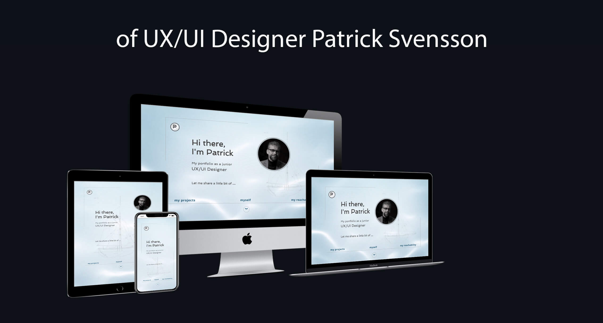

# The Portfolio

The portfolio is intended to showcase a selection of my best work and to demonstrate what I am, digitally, capable of achieving. Also, reflect a piece of my personality and some of my interests. This, to make sure that recruiters and employers easily can evaluate my potential.  
 
 

## Table of Contents

 

-   Features

    -   Existing Features
    -   Features left to implement

  

-   Testing

    -   Validator Testing
    -   JavaScript Code
    -   Website Performance
    -   Cross Device and Browser Compatibility

 

-   Technologies Used

-   Credits

    -   Media
    -   Testimonials
    -   CSS Animation
    -   Debugging
    -   Special Thanks

 
 

## Features

 

### Existing Features

-   The landing page

    -   A greeting and a brief presentation to give the user some information as to what the site is about. For a nautical ambiance, which is to show my keen interest in boats and sailing, I chose the round and rich font of Spinnaker for the header. To get the designer's perspective, the sections are incased in blueprint drawing frames.

    -   My logotype displaying my nickname Pat placed on top of the first letter of my surname. The design is my own, and the Spinnaker font is chosen to reflect my sailing passion. To save space, the logo is removed on small screens.

    -   To give the user a face to the name, I display a picture of myself which is set upon a background image of my drawing and design for the rig and sail plan to my pilot cutter.

    -   The landing page has a video background playing a soft wave motion that is supposed to reflect my calm personality and further enhance the nautical vibe of the website.

    -   A message is displayed to a user with a mobile device held in landscape mode, politely prompting to turn the device to portrait mode.

     

-   Navigation Bar

    -   Navigation links for quick and easy access to the sections, My Projects, Myself, and My Reachability.

    -   A Scroll Down button that indicates scroll down capacity, and when clicked, takes the user to the Testimonials section.

    -   An Up To Top button for easy navigation to the landing page.

     

-   Testimonials Section

    -   A background of a nautical chart to keep the maritime ambiance.

    -   I have chosen to show my testimonials in a slideshow, which the user can control by clicking on either the left or the right button beneath the testimonials card. The dots in between the buttons will indicate which card is currently on display.

     

-   My Projects Section

    -   Here I get the opportunity to show the various tools and techniques in my stack. Four portholes, each showing a filtered image of a project with a heading that names the main features of that particular project.

    -   Clicking on one of the portholes will open a modal. It will display a presentation of the project and links that open the project for inspection. The user can exit the modal by either clicking on the exit button or anywhere outside the modal box.

     

-   Myself Section

    -   I tell the user a little bit about who I am, what I have done in the past, and what I would like to achieve in the future. All in the easily readable font of Source Sans Pro.

    -   A photograph of me which, when hovered over, will turn into a picture of my boat. The pictures will give the user a clearer picture of my persona.

    -   If the user would like to find out more about my background, there is a link to my LinkedIn page.

    -   To keep our sealegs, I have divided the last two sections with some soothing animated waves.

     

-   My Reachability Section

    -   The background image that verifies my IxDF course "User Experience: The Beginner's Guide" with "Distinction: Top 10% in Class" certificate.

    -   Email address and a link to my LinkedIn page to make it easy for the user to contact me.

 
 

### Features Left to Implement

-   Some users may be sensitive to elements in motion. Thus, implementing an on/off toggle button on the landing page to enable the user to switch off/on animated features will make for better accessibility.

-   Render content on testimonial cards dynamicaly from an array, for DRY code.

-   Make my email address into a link that opens the "create a new message" window in the user's email service.

 
 

## Testing

 

### Validator Testing

-   HTML

    -   No errors were returned when passing through the official W3C validator.  
         

-   CSS

    -   No errors were found when passing through the official (Jigsaw) validator.

     

### JavaScript Code

-   JSHint
    -   No errors were found when passing through the code quality tool.

 

### Website Performance

-   GT Matrix

    -   Grade: A
        Performance: 99%

 

-   Pineberry

-   Lighthouse

    

 

### Cross Device and Browser Compatibility

-   The website has been tested on several desktops, laptops, tablets, and mobile devices by myself, family, and friends to assure as good cross-compatibility as possible.

-   Browsers

    -   Chrome
    -   Edge
    -   Firefox
    -   Safari

 
 

## Technologies, Libraries, and Frameworks Used

 

-   Photoshop
-   Figma
-   HTML5
-   CSS3
-   Sass (scss)
-   ITCSS (with @use and @forward, since @import is deprecated)
-   BEMIT
-   CSS clamp()
-   JavaScript
-   Git
-   GitHub
-   Google Fonts
-   Font Awesome
-   TinyPNG

 
 

## Credits

 

### Media

-   Landing page background video was downloaded from Pixabay open source, video by ArtDio2020 <https://pixabay.com/sv/videos/linje-form-wave-abstrakt-digital-45947/>

-   All photos are from my personal photo library.

 

### Testimonials

-   I wish to express my gratitude to my fellow students, Erica Zandelin and Ottilia Lindell, for the kind words that were given, and for letting me share those quotes as testimonials in this portfolio.

 

### CSS Animations

-   Waves (between the Myself- and the My Reachability section), a Codepen by Daniel Österman @Goodkatz.

 

### Debugging

-   stackoverflow
-   CSS-Tricks
-   MDN Web Docs
-   w3schools
-   Google

 

### Special Thanks

-   To my mentor Sandra Lindberg at Kodcoach for giving me such great advice, nudging me in the right direction, and for pushing me to write cleaner and more accessible code.

-   To my partner in code and in life, Helena Plantin <https://github.com/Helena-p>, for giving me the love and support I so desperately needed to create this portfolio.
